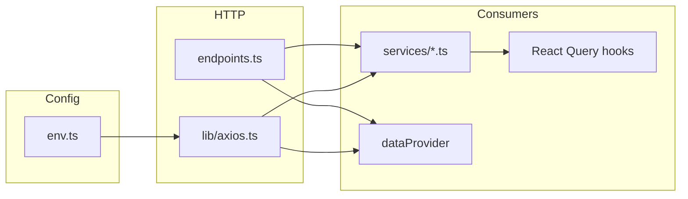

# API Layer Refactor Plan

**Generated:** 2026-05-12  
**Goal:** Enterprise SaaS–grade API layer: single axios instance, typed envelopes, one source of path truth, predictable React Query / Refine usage.

---

## Current state (already aligned)

| Area | Location | Notes |
|------|----------|-------|
| Env | [`src/config/env.ts`](../src/config/env.ts) | `VITE_API_ORIGIN` + `VITE_API_BASE_URL` → `API_BASE_URL`; `buildApiUrl`, `buildOriginUrl` |
| Axios | [`src/lib/axios.ts`](../src/lib/axios.ts) | Credentials, timeout, CSRF 419, optional JWT refresh, tenant header |
| Public re-export | [`src/services/api.ts`](../src/services/api.ts) | Default axios instance |
| Path catalog | [`src/services/endpoints.ts`](../src/services/endpoints.ts) | Primary REST paths |
| Refine | [`src/providers/dataProvider.tsx`](../src/providers/dataProvider.tsx) | Generic CRUD + envelopes |

---

## Gaps to close

### 1. Eliminate string literals for known resources

**Done:** `/trips`, `/vehicles`, `/drivers` literals replaced with `ENDPOINTS` in dashboard hooks and vehicle/driver forms.

**Remaining:** `SimpleCategoryTab` dynamic `` `/${resource}` `` (acceptable if resources stay server-aligned).

### 2. Trip workflow completeness

**Done:** `tripService.deliver(id)` implemented.

### 3. Normalize multipart uploads

- Prefer removing explicit `Content-Type: multipart/form-data` in callers (axios clears for `FormData` in interceptor) — audit [`publicFileUpload.ts`](../src/utils/publicFileUpload.ts).

### 4. SSE / fetch parity

- [`chat.service.ts`](../src/services/chat.service.ts): streaming uses `fetch` + `buildApiUrl` — acceptable; document that interceptors do not apply (handle 401 manually if needed).

### 5. Backend-driven pagination contract

- Standardize on `{ data: { data: [], meta: { total } } }` vs Laravel Resources — centralize `unwrapEnvelope` usage (already in `services/http`).

### 6. OpenAPI / Zod (optional next phase)

- Generate or hand-maintain Zod schemas per domain from Laravel API Resource definitions once backend is linked.

---

## Suggested architecture (target)

---

## Migration checklist

- [x] Replace ad-hoc `/trips`, `/vehicles`, `/drivers` references (dashboard + forms)
- [x] Expose `deliver` on `TripService`
- [ ] Run Laravel `route:list` and fill [FRONTEND_BACKEND_MAPPING.md](./FRONTEND_BACKEND_MAPPING.md)
- [ ] Update [API_COMPARISON_REPORT.md](./API_COMPARISON_REPORT.md) with matched/unmatched tables
- [ ] Add CI step: script greps for `api\.(get|post)\(['\"\`]/` and fails if new literals appear (allowlist)

---

## References

- Inventory: [API_INVENTORY.md](./API_INVENTORY.md)
- Risks: [BROKEN_ENDPOINTS_REPORT.md](./BROKEN_ENDPOINTS_REPORT.md)
- Audit: [INTEGRATION_AUDIT_REPORT.md](./INTEGRATION_AUDIT_REPORT.md)
