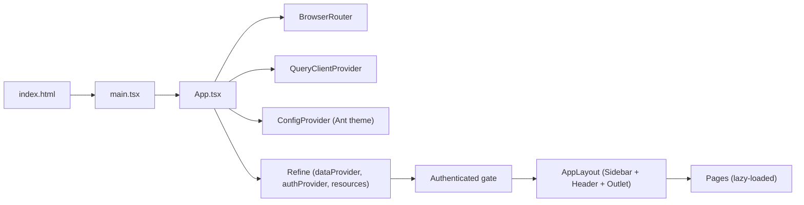
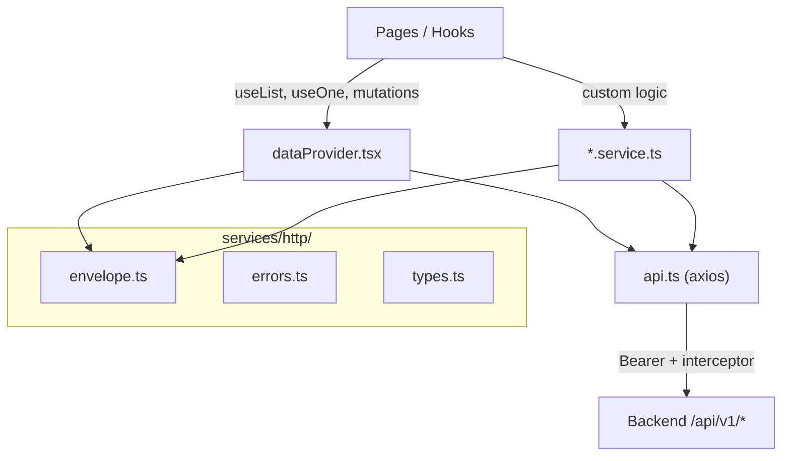

# Báo cáo toàn diện Frontend — Ship App

> **Phiên bản:** sinh từ mã nguồn `ship-app` (Vite + React) ngày 12/04/2026.
> **Mục đích:** tài liệu tham chiếu duy nhất cho developer FE/BE, BA, QA — bao gồm kiến trúc, chức năng, component, endpoint và payload.

**Tài liệu liên quan:**
- [`BAO_CAO_NOI_DUNG_FRONTEND_THONG_NHAT_BACKEND.md`](./BAO_CAO_NOI_DUNG_FRONTEND_THONG_NHAT_BACKEND.md) — hợp đồng FE-BE tóm tắt.
- [`FRONTEND_OVERVIEW_FOR_BACKEND.md`](./FRONTEND_OVERVIEW_FOR_BACKEND.md) — kiến trúc gọi API.
- [`FRONTEND_PAYLOADS_BY_SCREEN.md`](./FRONTEND_PAYLOADS_BY_SCREEN.md) — query + body theo màn.
- [`FRONTEND_RESPONSE_FIELDS_BY_RESOURCE.md`](./FRONTEND_RESPONSE_FIELDS_BY_RESOURCE.md) — trường JSON nhận vào.
- Backend: [`ship-app-api/docs/DATABASE_DATA_DICTIONARY.md`](../../ship-app-api/docs/DATABASE_DATA_DICTIONARY.md) — từ điển DB.

---

# Phần 1 — Tổng quan kiến trúc dự án

## 1.1. Tech stack

| Thành phần | Công nghệ | Ghi chú |
|------------|-----------|---------|
| Build / dev | **Vite 7** | Plugin `@vitejs/plugin-react`; alias `@` → `./src`; proxy `/api` → backend. |
| UI framework | **React 18** + TypeScript | SPA, không SSR. |
| Admin / CRUD | **Refine** (`@refinedev/core`, `antd`, `react-router-v6`, `simple-rest`) | `dataProvider` tùy chỉnh bọc axios. |
| Component lib | **Ant Design 5** | Form, Table, ConfigProvider (theme). |
| Design system | **Radix UI** + **shadcn**-style (`src/components/ui/`) | 40+ primitive: Button, Dialog, Sidebar, Sheet… |
| Styling | **Tailwind CSS 3** + **Sass** + **PostCSS** | `tailwind.config.js`, `src/styles/main.scss`. |
| HTTP | **Axios** (1 instance chung) | Bearer token, interceptor lỗi, `withCredentials`. |
| Async / cache | **TanStack React Query v5** | Song song với Refine internal query. |
| State | **Zustand** (persist) | `app.store.ts` (theme, locale), `auth.store.ts` (user, login). |
| Form | **Ant Design Form** + **react-hook-form** + **Zod** | Tùy màn; FormItem* wrapper. |
| Chart | **Recharts** | Dashboard revenue chart. |
| Drag-and-drop | **@dnd-kit** | Demo table (không dùng trong CRUD chính). |
| Misc | dayjs, date-fns, marked, DOMPurify, js-cookie, sonner, react-hot-toast | |

## 1.2. Luồng khởi chạy



1. `index.html` tải `/src/main.tsx` → mount `<App />` vào `#root`.
2. `App.tsx` bọc: `BrowserRouter` → `QueryClientProvider` → Ant `ConfigProvider` → `Refine`.
3. Route auth (`/login`, `/register`) render trực tiếp. Route xác thực qua `<Authenticated>` → `AppLayout` → `<Outlet />`.
4. `AppLayout` (`src/layouts/AppLayout.tsx`): `SidebarProvider` + `AppSidebar` + `SiteHeader` + Suspense `<Outlet />` + `FloatingChatAssistant`.

## 1.3. Cấu trúc thư mục `src/`

| Thư mục | Vai trò |
|---------|---------|
| `providers/` | `dataProvider.tsx`, `authProvider.tsx`, `resources.tsx`, `notificationProvider.ts` |
| `services/` | `api.ts` (axios), `endpoints.ts`, `http/` (envelope, errors, types), `*.service.ts` |
| `stores/` | Zustand: `app.store.ts`, `auth.store.ts` |
| `hooks/` | 16 custom hooks (dashboard, resource, auth, chat, form, toast…) |
| `components/` | `common/`, `form/`, `table/`, `dashboard/`, `ui/`, `modal/` + root (sidebar, header…) |
| `pages/` | 20 thư mục CRUD + `dashboard/`, `auth/`, `system/`, `reports/` |
| `routes/` | `index.ts` (ROUTES constants, aliases), `appRouteConfig.tsx` (lazy wiring) |
| `layouts/` | `AppLayout.tsx`, `AuthLayout.tsx` |
| `locales/` | `en.ts`, `vi.ts` — i18n |
| `types/` | `index.ts` (domain types), `schema-handoff.ts` (phase 1 planned) |
| `shared/query/` | TanStack query key factories, mutation helpers |
| `utils/` | `constants.ts`, `errorHandler.ts`, helper functions |
| `lib/` | `auth-session.ts`, `safe-storage.ts` |
| `styles/` | `main.scss`, `variables.scss`, `components.scss` |

## 1.4. Quản lý state

| Cơ chế | File | Dữ liệu |
|--------|------|----------|
| **Zustand** (persist) | `stores/app.store.ts` | theme (light/dark), sidebarOpen, locale, compactMode, notification prefs |
| **Zustand** (persist) | `stores/auth.store.ts` | user, isAuthenticated, login/logout/checkAuth actions |
| **TanStack Query** | `App.tsx` (`appQueryClient`) | Dashboard stats, resource lists, chat sessions |
| **Refine internal** | via `dataProvider` | CRUD data hooks (`useList`, `useOne`, mutations) |
| **React Context** | `components/ui/*` | Chỉ dùng trong UI primitives (Sidebar, Carousel, Chart) |

## 1.5. Tầng API



- **`api.ts`**: axios instance, `baseURL = API_BASE_URL` (mặc định `/api/v1`), Bearer từ localStorage, `withCredentials: true`, interceptor 401 → logout, toast lỗi.
- **`dataProvider.tsx`**: override `getList` / `getOne` / `create` / `update` / `deleteOne` — map Refine params → REST query/body.
- **`*.service.ts`**: logic nghiệp vụ ngoài CRUD (auth, chat stream, payroll workflow, reports, permissions sync…).
- **`http/`**: `throwIfEnvelopeFailed`, `unwrapEnvelope`, `ApiEnvelope<T>`, `normalizeApiError`.

## 1.6. Routing

| File | Vai trò |
|------|---------|
| `routes/index.ts` | Hằng số `ROUTES` (login, register, dashboard, admin CRUD, system pages); `RESOURCE_ALIASES`; helper `getResourceEditRoute` / `getResourceShowRoute`. |
| `routes/appRouteConfig.tsx` | `AppPages` (lazy import), `crudRoutes` (resource → List + Form + optional requiredRole), `singleRoutes` (reports, notifications, profile, settings, billing, driver schedule). `ProtectedRoute` bọc route cần quyền. |

---

# Phần 2 — Từng chức năng

## 2.1. Companies

| Hạng mục | Chi tiết |
|----------|---------|
| **Files** | `CompaniesList.tsx`, `CompanyForm.tsx`, `CompanyFormDialog.tsx` |
| **Resource** | `companies` → `GET/POST/PUT/DELETE /companies` |
| **Cột list** | code, name, tax_code, address, phone, email, status (badge), actions |
| **Tab** | All / Active / Inactive (sync filter `status`) |
| **Filter** | search (`keyword`), status select |
| **Form fields** | code, name, tax_code, address, phone, email, status |
| **Đặc biệt** | Bulk import Excel (khi `getCompanyCreateFeatureFlags` bật) trong dialog tạo |

## 2.2. Offices

| Hạng mục | Chi tiết |
|----------|---------|
| **Files** | `OfficesList.tsx`, `OfficeForm.tsx`, `OfficeFormDialog.tsx` |
| **Resource** | `offices` → `/offices` |
| **Cột list** | code, name, company (badge), address, actions |
| **Filter** | search, company_id (paginated select) |
| **Form fields** | company_id, code, name, address |

## 2.3. Departments

| Hạng mục | Chi tiết |
|----------|---------|
| **Files** | `DepartmentsList.tsx`, `DepartmentForm.tsx`, `DepartmentFormDialog.tsx` |
| **Resource** | `departments` → `/departments` |
| **Cột list** | code, name, office (badge), actions |
| **Filter** | search, office_id |
| **Form fields** | office_id, parent_id (optional), code, name |

## 2.4. Positions

| Hạng mục | Chi tiết |
|----------|---------|
| **Files** | `PositionsList.tsx`, `PositionForm.tsx`, `PositionFormDialog.tsx` |
| **Resource** | `positions` → `/positions` |
| **Cột list** | code, name, base_salary (VND), level, actions |
| **Filter** | search |
| **Form fields** | code, name, base_salary, level |

## 2.5. Employees

| Hạng mục | Chi tiết |
|----------|---------|
| **Files** | `EmployeesList.tsx`, `EmployeeForm.tsx`, `EmployeeFormDialog.tsx` |
| **Resource** | `employees` → `/employees` |
| **Cột list** | code, name, email, phone, type (office/driver), status, office (name), actions |
| **Tab** | All / Active / Inactive (`status`) |
| **Filter** | search, type select (office/driver) |
| **Form fields** | code, name, email, phone, type, status |

## 2.6. Drivers

| Hạng mục | Chi tiết |
|----------|---------|
| **Files** | `DriversList.tsx`, `DriverForm.tsx`, `DriverFormDialog.tsx`, `DriverSchedulePage.tsx` |
| **Resource** | `drivers` → `/drivers` |
| **Cột list** | employee (name), license_no, license_class, expired_date, available_status, actions |
| **Tab** | All / Available / On trip / Off |
| **Filter** | search, available_status select |
| **Form fields** | employee_id; license_no, license_class, expired_date, available_status; id_card_no, id_card_issue_date, permanent_address; upload id_card_front/back; insurance_provider, insurance_policy_no, insurance_expiry_date, insurance_doc (upload); profile_notes |
| **Đặc biệt** | Link tới **Driver Schedule** (tuần, textarea mỗi ô ngày, export/copy JSON) |

## 2.7. Users

| Hạng mục | Chi tiết |
|----------|---------|
| **Files** | `UsersList.tsx`, `UserForm.tsx`, `UserFormDialog.tsx` |
| **Resource** | `users` → `/users` |
| **Cột list** | username, email, employee name, status, roles (joined), actions |
| **Filter** | search, status (active/inactive) |
| **Form fields** | username, email, employee_id (optional), role_ids (multi), password (create only), status |

## 2.8. Roles

| Hạng mục | Chi tiết |
|----------|---------|
| **Files** | `RolesList.tsx`, `RoleForm.tsx`, `RoleFormDialog.tsx` |
| **Resource** | `roles` → `/roles` |
| **Cột list** | name, description, permissions (count), actions |
| **Filter** | search |
| **Form fields** | name, description, permission_ids (multi select) |
| **Đặc biệt** | Sau create/update role → gọi `syncRolePermissions` (`POST /roles/:id/permissions`) |

## 2.9. Vehicles

| Hạng mục | Chi tiết |
|----------|---------|
| **Files** | `VehiclesList.tsx`, `VehicleForm.tsx`, `VehicleFormDialog.tsx` |
| **Resource** | `vehicles` → `/vehicles` |
| **Cột list** | plate_number, type, brand, model, year, capacity, status, actions |
| **Tab** | All / Active / Inactive |
| **Filter** | search, status |
| **Form fields** | plate_number, type, brand, model, year, capacity, status |

## 2.10. Vehicle Assignments

| Hạng mục | Chi tiết |
|----------|---------|
| **Files** | `VehicleAssignmentsList.tsx`, `VehicleAssignmentForm.tsx`, `VehicleAssignmentFormDialog.tsx` |
| **Resource** | `vehicle_assignments` → `/vehicle_assignments` |
| **Cột list** | vehicle (plate), driver (employee name), from_date, to_date, actions |
| **Filter** | Không có |
| **Form fields** | vehicle_id, driver_id, from_date, to_date |

## 2.11. Vehicle Expenses

| Hạng mục | Chi tiết |
|----------|---------|
| **Files** | `VehicleExpensesList.tsx`, `VehicleExpenseForm.tsx`, `VehicleExpenseFormDialog.tsx` |
| **Resource** | `vehicle_expenses` → `/vehicle_expenses` |
| **Cột list** | vehicle, type, amount (VND), expense_date, actions |
| **Filter** | Không có |
| **Form fields** | vehicle_id, driver_id (optional), type (fuel/maintenance/repair/toll/parking/other), amount, expense_date, note |

## 2.12. Customers

| Hạng mục | Chi tiết |
|----------|---------|
| **Files** | `CustomersList.tsx`, `CustomerForm.tsx`, `CustomerFormDialog.tsx` |
| **Resource** | `customers` → `/customers` |
| **Cột list** | name, type (company/individual), tax_code, email, phone, actions |
| **Filter** | search, type (company/individual) |
| **Form fields** | name, type, tax_code (required nếu type=company), email, phone, address, contact_person |

## 2.13. Trips

| Hạng mục | Chi tiết |
|----------|---------|
| **Files** | `TripsList.tsx`, `TripForm.tsx`, `TripFormDialog.tsx` |
| **Resource** | `trips` → `/trips` |
| **Cột list** | code, start_point, end_point, distance_km, price (VND), status (badge), start_time, actions menu |
| **Filter** | company_id, office_id (phụ thuộc company), search |
| **Form fields** | code, customer_id, driver_id, vehicle_id, start_point, end_point, distance_km, price, status (options tùy mode), start_time, end_time |
| **Đặc biệt** | Actions menu: Start trip (`status → in_progress`), Complete trip (`→ completed`), Delete — gọi `tripService.updateStatus` |

## 2.14. Trip Bonus Rules

| Hạng mục | Chi tiết |
|----------|---------|
| **Files** | `TripBonusRulesList.tsx`, `TripBonusRuleForm.tsx`, `TripBonusRuleFormDialog.tsx` |
| **Resource** | `trip_bonus_rules` → `/trip_bonus_rules` |
| **Cột list** | distance range (min–max km), bonus_per_km (VND), actions |
| **Filter** | Không có |
| **Form fields** | min_km, max_km (optional), bonus_per_km |

## 2.15. Invoices

| Hạng mục | Chi tiết |
|----------|---------|
| **Files** | `InvoicesList.tsx`, `InvoiceForm.tsx`, `InvoiceFormDialog.tsx` |
| **Resource** | `invoices` → `/invoices` |
| **Cột list** | code, customer, trip, total_amount, status (draft/issued/paid), actions |
| **Filter** | search, status (draft/issued/paid) |
| **Form fields** | code, customer_id, trip_id (completed trips only), total_amount (auto = trip price + tax), tax_amount, issued_at, due_date, status |

## 2.16. Allowances

| Hạng mục | Chi tiết |
|----------|---------|
| **Files** | `AllowancesList.tsx`, `AllowanceForm.tsx`, `AllowanceFormDialog.tsx` |
| **Resource** | `allowances` → `/allowances` |
| **Cột list** | code, name, default_amount, taxable (yes/no), actions |
| **Filter** | Không có |
| **Form fields** | code, name, default_amount, taxable (switch) |

## 2.17. Deductions

| Hạng mục | Chi tiết |
|----------|---------|
| **Files** | `DeductionsList.tsx`, `DeductionForm.tsx`, `DeductionFormDialog.tsx` |
| **Resource** | `deductions` → `/deductions` |
| **Cột list** | code, name, actions |
| **Filter** | Không có |
| **Form fields** | code, name |

## 2.18. Attendances

| Hạng mục | Chi tiết |
|----------|---------|
| **Files** | `AttendancesList.tsx`, `AttendanceForm.tsx`, `AttendanceFormDialog.tsx` |
| **Resource** | `attendances` → `/attendances` |
| **Cột list** | employee, date, check_in, check_out, status (present/absent/late/half_day/leave), actions |
| **Filter** | Không có |
| **Form fields** | employee_id, date, check_in, check_out, work_hours (auto, disabled), overtime_hours (auto, disabled), status |

## 2.19. Payrolls

| Hạng mục | Chi tiết |
|----------|---------|
| **Files** | `PayrollsList.tsx`, `PayrollForm.tsx`, `PayrollFormDialog.tsx` |
| **Resource** | `payrolls` → `/payrolls` |
| **Cột list** | month (localized), year, status, locked_at, actions |
| **Filter** | Không có |
| **Form fields** | company_id, month, year |
| **Đặc biệt** | Row actions: **Approve** (draft/generated → approved), **Lock** (approved → locked, admin only), **Export JSON** (`payrollService.downloadExport`) |

## 2.20. Permissions (không có CRUD page riêng)

Permissions không có màn list/form riêng. Được load qua `fetchPermissionsPage` (`GET /permissions`) và hiển thị dưới dạng multi-select trong `RoleFormDialog`.

---

## 2.21. Trang đặc biệt

### Dashboard (`pages/dashboard/dashboard.tsx`)

- **Stats cards**: `useDashboardStats` → `GET /reports/dashboard` (polling 60s).
- **Revenue chart**: `ChartAreaInteractive` (lazy, Recharts) — `useDashboardRevenueChartData` fetch all completed trips → aggregate daily revenue.
- **Recent trips**: `DashboardRecentTrips` → Refine `useList('trips')`.
- **Filter**: company_id (select).

### Auth (`pages/auth/`)

- **Login** (`login-form.tsx`): email, password; optional test-account quick login (`GET /auth/test-accounts`).
- **Register** (`register-form.tsx`): username, email, password, password_confirmation.

### System (`pages/system/`)

- **Profile.tsx**: hiển thị user info (placeholder form, chưa submit).
- **Settings.tsx**: theme, locale, compact mode, notification toggles, API health check (`GET /health` qua `useApiRoot`).
- **Billing.tsx**: placeholder "coming soon".
- **Notifications.tsx**: `AttendanceLatePanel`.

### Reports (`pages/reports/Reports.tsx`)

- Month/year/company filter (URL-synced).
- Dashboard snapshot card + payroll summary card.
- `reportsService.getDashboard` + `reportsService.getPayrollSummary`.

### Driver Schedule (`pages/drivers/DriverSchedulePage.tsx`)

- Load drivers (lên đến 500), hiển thị lưới tuần (Mon–Sun) với textarea mỗi ô.
- Prev/next week, export JSON, copy JSON clipboard. State local (không persist lên API).

---

# Phần 3 — Common Components & Hooks

## 3.1. Components — `common/`

| Component | File | Mô tả | Props chính |
|-----------|------|-------|-------------|
| **PageHeader** | `PageHeader.tsx` | Tiêu đề trang + breadcrumb + actions | `title`, `description?`, `breadcrumb?`, `actions?` |
| **Breadcrumb** | `Breadcrumb.tsx` | Home + trail links | `items: { label, path? }[]` |
| **ListPageFilters** | `ListPageFilters.tsx` | Compound toolbar: root + `.Search` + `.Actions` | `variant`, `children`, `className?` |
| **SearchField** | `SearchField.tsx` | Input tìm kiếm với icon | `value`, `onChange`, `placeholder?`, `className?` |
| **FilterBar** | `FilterBar.tsx` | Ant keyword + status filter bar | `form?`, `initialValues?`, `statusOptions?`, `onSearch?`, `onReset?`, `loading?` |
| **ProtectedRoute** | `ProtectedRoute.tsx` | Auth + role/permission gate | `children`, `requiredRole?`, `requiredPermission?` |
| **DeleteConfirmDialog** | `DeleteConfirmDialog.tsx` | Radix alert confirm xóa | `open`, `onOpenChange`, `onConfirm`, `title?`, `description?`, `itemName?`, `loading?` |
| **UnsavedChangesWarningDialog** | `UnsavedChangesWarningDialog.tsx` | Confirm discard form chưa lưu | `open`, `onOpenChange`, `onConfirmDiscard` |
| **ErrorState** | `ErrorState.tsx` | UI lỗi centered + retry | `title?`, `description?`, `onRetry?`, `className?` |
| **EmptyState** | `EmptyState.tsx` | Empty list placeholder + CTA | `icon?`, `title`, `description?`, `action?`, `className?` |
| **PageLoadingOverlay** | `PageLoadingOverlay.tsx` | Dim + Ant Spin khi loading | `loading`, `children`, `className?`, `minHeight?` |
| **AppLoadingSpin** | `AppLoadingSpin.tsx` | Spinner full-area / outlet / section | `variant?` (`page`/`outlet`/`section`), `className?` |
| **TableSkeleton** | `TableSkeleton.tsx` | Skeleton giả table | `rows?`, `columns?` (mặc định 5) |
| **DateTimeBadge** | `DateTimeBadge.tsx` | Badge + tooltip cho ISO date | `value?`, `mode?` (`date`/`datetime`), `emptyText?` |
| **LanguageSwitcher** | `LanguageSwitcher.tsx` | Dropdown VI/EN | Không props |
| **NotificationPopup** | `NotificationPopup.tsx` | Header bell dropdown: tabs, activity list | `children?` (trigger override) |
| **NotificationItem** | `NotificationItem.tsx` | Một dòng activity log | `notification: ActivityLog`, `onClick?` |
| **FloatingChatAssistant** | `FloatingChatAssistant.tsx` | FAB kéo thả mở chat panel | Không props |
| **ChatAssistantPanel** | `ChatAssistantPanel.tsx` | Full chat UI (sessions, streaming) | `className?`, `compact?` |
| **MessageRenderer** | `chat/MessageRenderer.tsx` | Render markdown (marked + DOMPurify) | `content: string` |
| **AttendanceLatePanel** | `AttendanceLatePanel.tsx` | Attendance / late workflow UI | Không props |

## 3.2. Components — `form/`

Các wrapper bọc Ant Design Form.Item + control tương ứng. Type chung: `form/types.ts` (`BaseFormItemProps`, `SelectOption`…).

| Component | File | Mô tả |
|-----------|------|-------|
| **FormItemText** | `FormItemText.tsx` | Input text |
| **FormItemTextArea** | `FormItemTextArea.tsx` | Textarea |
| **FormItemNumber** | `FormItemNumber.tsx` | InputNumber |
| **FormItemSelect** | `FormItemSelect.tsx` | Select + options, hỗ trợ scroll hooks (paginated) |
| **FormItemSwitch** | `FormItemSwitch.tsx` | Boolean switch |
| **FormItemUploadDragger** | `FormItemUploadDragger.tsx` | Upload dragger |
| **FormAccordionSections** | `FormAccordionSections.tsx` | Accordion chia section form dài |

Barrel export: `form/index.ts`.

## 3.3. Components — `table/`

| Component | File | Mô tả | Dùng ở |
|-----------|------|-------|--------|
| **DataTable** | `DataTable.tsx` | Bảng HTML mặc định + empty state + pagination | Hầu hết `*List.tsx` |
| **Pagination** | `Pagination.tsx` | Prev/next + page numbers | Bên trong DataTable |
| **BaseTable** | `BaseTable.tsx` | Ant Table + Refine useNavigation/useDelete | Ít dùng (thay thế bởi DataTable) |
| **BaseTableHeader** | `BaseTableHeader.tsx` | Title, search, breadcrumbs cho table | Companion cho BaseTable |
| **ProfessionalAntTable** | `ProfessionalAntTable.tsx` | Demo Ant table styled | Showcase, không CRUD |

## 3.4. Components — `dashboard/`

| Component | File | Mô tả |
|-----------|------|-------|
| **DashboardRecentTrips** | `DashboardRecentTrips.tsx` | Card recent trips (Refine `useList`) |
| **DashboardChartSkeleton** | `DashboardChartSkeleton.tsx` | Skeleton cho chart lazy-load |

## 3.5. Components — Root-level

| Component | File | Mô tả |
|-----------|------|-------|
| **AppSidebar** | `app-sidebar.tsx` | Sidebar chính: routes, role-based menu, wraps NavMain + NavUser |
| **NavMain** | `nav-main.tsx` | Sidebar nav: flat / collapsible groups, highlight active |
| **NavUser** | `nav-user.tsx` | Sidebar user area: quick links + account dropdown |
| **SiteHeader** | `site-header.tsx` | Top bar: sidebar trigger, search, language, theme, NotificationPopup |
| **SectionCards** | `section-cards.tsx` | Dashboard stat cards (counts, revenue) |
| **ChartAreaInteractive** | `chart-area-interactive.tsx` | Dashboard multi-series revenue line chart (Recharts) |

## 3.6. Components — `ui/` (shadcn / Radix primitives)

40+ building blocks, chia theo nhóm:

| Nhóm | Components |
|------|-----------|
| **Form / Input** | `button`, `input`, `textarea`, `label`, `checkbox`, `radio-group`, `switch`, `select` (Radix), `input-otp`, `input-group`, `calendar`, `slider` |
| **Layout** | `card`, `separator`, `scroll-area`, `resizable`, `aspect-ratio`, `sidebar`, `sheet`, `drawer`, `dialog`, `tabs`, `accordion`, `collapsible` |
| **Navigation** | `dropdown-menu`, `navigation-menu`, `menubar`, `context-menu`, `breadcrumb`, `pagination`, `command` (cmdk) |
| **Feedback** | `alert`, `alert-dialog`, `toast`, `toaster`, `sonner`, `progress`, `spinner`, `skeleton` |
| **Data display** | `table`, `badge`, `avatar`, `chart`, `carousel`, `hover-card`, `popover`, `tooltip`, `toggle`, `toggle-group` |

Re-export tại `ui/index.ts`; nhiều file import trực tiếp bằng path `@/components/ui/...`.

---

## 3.7. Hooks

| Hook | File | Mô tả | Params | Return | API |
|------|------|-------|--------|--------|-----|
| **useAuth** | `useAuth.ts` | Sync auth, requireAuth, hasRole, hasPermission | — | `{ user, isAuthenticated, requireAuth, hasRole, hasPermission }` | `useAuthStore` |
| **usePermission** | `usePermission.ts` | can/cannot/canAny/canAll/hasRole | — | `{ can, cannot, canAny, canAll, hasRole }` | `useAuth` (store) |
| **useTranslation** | `useTranslation.ts` | `t(key, params?)` locale-aware | — | `{ t, locale, setLocale }` | `useAppStore` |
| **useDashboardStats** | `useDashboardStats.ts` | KPI stats, polling | `{ enablePolling?, pollingInterval?, companyId? }` | `{ stats, statsLoading, statsError, refetchStats }` | `dashboardService.getStats` → `GET /reports/dashboard` |
| **useDashboardTripRevenue** | `useDashboardTripRevenue.ts` | Revenue tổng tháng (client filter) | `{ companyId?, month?, year? }` | `{ total, tripCount, loading, error, refetch }` | `api.get('/trips')` |
| **useDashboardRevenueChartData** | `useDashboardRevenueChartData.ts` | Daily revenue series cho chart | `{ companyId?, timeRange, offices }` | `{ chartData, seriesKeys, loading, error, refetch }` | `api.get('/trips')` |
| **useResourceListQuery** | `useResourceListQuery.ts` | TanStack query cho Refine getList | `{ resource, current, pageSize?, filters?, sorters? }` | TanStack `useQuery` result | `dataProvider.getList` |
| **useResourceDeleteMutation** | `useResourceDeleteMutation.ts` | TanStack mutation xóa + invalidate | `resource: string` | `useMutation` with `mutate({ id })` | `dataProvider.deleteOne` |
| **usePaginatedResourceSelectOptions** | `usePaginatedResourceSelectOptions.ts` | Infinite-query cho dropdown scroll | `{ resource, filters?, sorters?, mapOption, enabled? }` | `{ options, isLoading, isFetchingNextPage, onPopupScroll, hasNextPage }` | `dataProvider.getList` |
| **useFormDialogCloseGuard** | `useFormDialogCloseGuard.ts` | Guard đóng dialog khi form dirty | `{ form, isViewMode, isSubmitting?, onClose }` | `{ requestClose, handleDialogOpenChange, unsavedChangesWarningProps }` | — |
| **useChatSession** | `useChatSession.ts` | Chat state: sessions, messages, stream, delete | `t` (translate fn) | Nhiều handler/state | `chatService.*` |
| **useNotifications** | `useNotifications.ts` | Placeholder (empty, BE chưa ready) | `{ enablePolling?, pollingInterval? }` | `{ activityLogs: [], refetch, markRead }` | Không gọi API |
| **useSafeRefetch** | `useSafeRefetch.ts` | Wrap refetch + debounce | `(key, refetch, cooldownMs?)` | `safeRefetch(force?)` | — |
| **useGuardedAsync** | `useGuardedAsync.ts` | Debounce/dedupe async by key | `(defaultCooldownMs?)` | `{ run(key, task, options?) }` | — |
| **useIsMobile** | `use-mobile.tsx` | Viewport < 768px | — | `boolean` | DOM matchMedia |
| **useToast** | `use-toast.ts` | Global toast state cho shadcn Toaster | — | `{ toasts, toast, dismiss }` | — |

---

# Phần 4 — Bảng master Endpoint

## 4.1. Auth & Public

| # | Method | Path | Mô tả | Service / nơi gọi |
|---|--------|------|-------|--------------------|
| 1 | POST | `/auth/login` | Đăng nhập | `authService.login` |
| 2 | POST | `/auth/register` | Đăng ký | `authService.register` |
| 3 | POST | `/auth/logout` | Đăng xuất | `authService.logout` |
| 4 | POST | `/auth/refresh` | Refresh token | `authService.refreshToken` |
| 5 | GET | `/user` | Profile user hiện tại | `authService.getCurrentUser` |
| 6 | GET | `/auth/test-accounts` | Tài khoản test (dev) | `login-form.tsx` (inline) |
| 7 | GET | `/` | Root | `ENDPOINTS.public.root` |
| 8 | GET | `/health` | Health check | `Settings.tsx` (via `useApiRoot`) |
| 9 | GET | `/documentation` | API docs | `ENDPOINTS.public.docs` |

## 4.2. CRUD Resources (qua `dataProvider`)

Mỗi resource có 5 endpoint chuẩn (trừ ghi chú):

| # | Resource | GET list | GET detail | POST create | PUT update | DELETE |
|---|----------|----------|-----------|-------------|------------|-------|
| 10–14 | `companies` | `/companies` | `/companies/:id` | `/companies` | `/companies/:id` | `/companies/:id` |
| 15–19 | `offices` | `/offices` | `/offices/:id` | `/offices` | `/offices/:id` | `/offices/:id` |
| 20–24 | `departments` | `/departments` | `/departments/:id` | `/departments` | `/departments/:id` | `/departments/:id` |
| 25–29 | `positions` | `/positions` | `/positions/:id` | `/positions` | `/positions/:id` | `/positions/:id` |
| 30–34 | `employees` | `/employees` | `/employees/:id` | `/employees` | `/employees/:id` | `/employees/:id` |
| 35–39 | `drivers` | `/drivers` | `/drivers/:id` | `/drivers` | `/drivers/:id` | `/drivers/:id` |
| 40–44 | `users` | `/users` | `/users/:id` | `/users` | `/users/:id` | `/users/:id` |
| 45–49 | `roles` | `/roles` | `/roles/:id` | `/roles` | `/roles/:id` | `/roles/:id` |
| 50–54 | `vehicles` | `/vehicles` | `/vehicles/:id` | `/vehicles` | `/vehicles/:id` | `/vehicles/:id` |
| 55–59 | `vehicle_assignments` | `/vehicle_assignments` | `/vehicle_assignments/:id` | `/vehicle_assignments` | `/vehicle_assignments/:id` | `/vehicle_assignments/:id` |
| 60–64 | `vehicle_expenses` | `/vehicle_expenses` | `/vehicle_expenses/:id` | `/vehicle_expenses` | `/vehicle_expenses/:id` | `/vehicle_expenses/:id` |
| 65–69 | `customers` | `/customers` | `/customers/:id` | `/customers` | `/customers/:id` | `/customers/:id` |
| 70–74 | `trips` | `/trips` | `/trips/:id` | `/trips` | `/trips/:id` | `/trips/:id` |
| 75–79 | `trip_bonus_rules` | `/trip_bonus_rules` | `/trip_bonus_rules/:id` | `/trip_bonus_rules` | `/trip_bonus_rules/:id` | `/trip_bonus_rules/:id` |
| 80–84 | `invoices` | `/invoices` | `/invoices/:id` | `/invoices` | `/invoices/:id` | `/invoices/:id` |
| 85–89 | `allowances` | `/allowances` | `/allowances/:id` | `/allowances` | `/allowances/:id` | `/allowances/:id` |
| 90–94 | `deductions` | `/deductions` | `/deductions/:id` | `/deductions` | `/deductions/:id` | `/deductions/:id` |
| 95–99 | `attendances` | `/attendances` | `/attendances/:id` | `/attendances` | `/attendances/:id` | `/attendances/:id` |
| 100–104 | `payrolls` | `/payrolls` | `/payrolls/:id` | `/payrolls` | `/payrolls/:id` | `/payrolls/:id` |

## 4.3. Roles & Permissions (ngoài CRUD)

| # | Method | Path | Mô tả | Service |
|---|--------|------|-------|---------|
| 105 | POST | `/roles/:roleId/permissions` | Sync quyền cho role | `syncRolePermissions` (`roles.service.ts`) |
| 106 | GET | `/permissions` | List tất cả quyền (phân trang) | `fetchPermissionsPage` (`permissions.service.ts`) |
| 107 | GET | `/permissions/:id` | Chi tiết quyền | `fetchPermissionById` |

## 4.4. Payroll (ngoài CRUD)

| # | Method | Path | Mô tả | Service |
|---|--------|------|-------|---------|
| 108 | POST | `/payrolls/:id/approve` | Duyệt bảng lương | `payrollService.approve` |
| 109 | POST | `/payrolls/:id/lock` | Khóa bảng lương | `payrollService.lock` |
| 110 | GET | `/payrolls/:id/export` | Export JSON bảng lương | `payrollService.downloadExport` |
| 111 | GET | `/payrolls/my-salary` | Lương cá nhân | `payrollService.getMySalary` |

## 4.5. Reports

| # | Method | Path | Mô tả | Service |
|---|--------|------|-------|---------|
| 112 | GET | `/reports/dashboard` | Thống kê dashboard | `dashboardService.getStats`, `reportsService.getDashboard` |
| 113 | GET | `/reports/payroll-summary` | Tổng hợp lương theo công ty | `reportsService.getPayrollSummary` |

## 4.6. Chat

| # | Method | Path | Mô tả | Service |
|---|--------|------|-------|---------|
| 114 | GET | `/chat/sessions` | List chat sessions | `chatService.getSessions` |
| 115 | DELETE | `/chat/sessions/:id` | Xóa session | `chatService.deleteSession` |
| 116 | GET | `/chat/messages` | List messages | `chatService.getMessages` |
| 117 | POST | `/chat/messages` | Gửi tin nhắn | `chatService.sendMessage` |
| 118 | POST | `/chat/messages/stream` | Gửi tin nhắn (SSE stream) | `chatService.sendMessageStream` (fetch) |

## 4.7. Attendance Late

| # | Method | Path | Mô tả | Service |
|---|--------|------|-------|---------|
| 119 | GET | `/attendances/late/list` | Danh sách đi muộn | `attendanceNotificationsService.listLateAttendances` |
| 120 | POST | `/attendances/late/notify` | Gửi thông báo đi muộn | `attendanceNotificationsService.notifyLateAttendances` |

## 4.8. V2 (base `/api`)

| # | Method | Path | Mô tả | Service |
|---|--------|------|-------|---------|
| 121 | GET | `/v2/employees` | List employees v2 | `ENDPOINTS.v2.employees` (qua `useApiRoot`) |
| 122 | GET | `/v2/employees/:id` | Detail employee v2 | `ENDPOINTS.v2.employees.byId` |

**Tổng: ~122 endpoint** (5 × 20 CRUD + 22 đặc biệt).

---

# Phần 5 — Payload chi tiết từng Endpoint

## 5.1. Envelope chung

**Response thành công (list):**
```json
{
  "success": true,
  "message": "optional",
  "data": {
    "data": [/* records */],
    "meta": { "total": 0, "current_page": 1, "last_page": 1, "per_page": 15 }
  }
}
```

**Response thành công (single):**
```json
{ "success": true, "message": "optional", "data": { /* record */ } }
```

**Response lỗi:**
```json
{ "success": false, "message": "Error text", "errors": { "field": ["..."] } }
```

Type TS: `ApiResponse<T>`, `ApiEnvelope<T>`, `ApiListPayload<T>` (`src/types/index.ts`, `src/services/http/types.ts`).

## 5.2. CRUD chung — Query `GET /{resource}` (list)

| Param | Kiểu | Mô tả |
|-------|------|-------|
| `page` | number | Trang (mặc định 1) |
| `per_page` | number | Kích thước (1–100, mặc định 15) |
| `keyword` | string | Tìm kiếm (FE map `search`/`q` → `keyword`) |
| `sort_by` | string | Tên field sort |
| `sort_order` | `asc` \| `desc` | Thứ tự |
| *(filter riêng)* | — | Tùy resource (xem bảng 5.3) |

## 5.3. Filter riêng theo resource

| Resource | Filter query params |
|----------|-------------------|
| `companies` | `keyword`, `status` (`active`/`inactive`) |
| `offices` | `keyword`, `company_id` |
| `departments` | `keyword`, `office_id` |
| `positions` | `keyword` |
| `employees` | `keyword`, `type` (`office`/`driver`), `status` (`active`/`inactive`) |
| `drivers` | `keyword`, `available_status` (`available`/`on_trip`/`off`) |
| `users` | `keyword`, `status` (`active`/`inactive`) |
| `roles` | `keyword` |
| `vehicles` | `keyword`, `status` (`active`/`maintenance`/`inactive`) |
| `vehicle_assignments` | *(không có filter riêng)* |
| `vehicle_expenses` | *(không có filter riêng)* |
| `customers` | `keyword`, `type` (`company`/`individual`) |
| `trips` | `company_id`, `office_id`, `status` (`pending`/`in_progress`/`completed`/`cancelled`) |
| `trip_bonus_rules` | *(không có filter riêng)* |
| `invoices` | `keyword`, `status` (`draft`/`issued`/`paid`) |
| `allowances` | *(không có filter riêng)* |
| `deductions` | *(không có filter riêng)* |
| `attendances` | *(không có filter riêng)* |
| `payrolls` | *(không có filter riêng)* |

## 5.4. Body `POST` / `PUT` theo resource (form fields)

### `companies`
```json
{ "code": "string", "name": "string", "tax_code": "string?", "address": "string?", "phone": "string?", "email": "string?", "status": "active|inactive" }
```

### `offices`
```json
{ "company_id": "number", "code": "string", "name": "string", "address": "string?" }
```

### `departments`
```json
{ "office_id": "number", "parent_id": "number?", "code": "string", "name": "string" }
```

### `positions`
```json
{ "code": "string", "name": "string", "base_salary": "number", "level": "number?" }
```

### `employees`
```json
{ "code": "string", "name": "string", "email": "string?", "phone": "string?", "type": "office|driver", "status": "string" }
```

### `drivers`
```json
{
  "employee_id": "number",
  "license_no": "string", "license_class": "string", "expired_date": "string?",
  "available_status": "string?",
  "id_card_no": "string?", "id_card_issue_date": "string?", "permanent_address": "string?",
  "id_card_front": "File?", "id_card_back": "File?",
  "insurance_provider": "string?", "insurance_policy_no": "string?",
  "insurance_expiry_date": "string?", "insurance_doc": "File?",
  "profile_notes": "string?"
}
```

### `users`
```json
{ "username": "string", "email": "string", "employee_id": "number?", "role_ids": "number[]", "password": "string (create only)?", "status": "string" }
```

### `roles`
```json
{ "name": "string", "description": "string?" }
```
*Sau đó sync permissions:* `POST /roles/:id/permissions` → `{ "permission_ids": [1, 2, 3] }`

### `vehicles`
```json
{ "plate_number": "string", "type": "string", "brand": "string?", "model": "string?", "year": "number?", "capacity": "number?", "status": "string" }
```

### `vehicle_assignments`
```json
{ "vehicle_id": "number", "driver_id": "number", "from_date": "string", "to_date": "string?" }
```

### `vehicle_expenses`
```json
{ "vehicle_id": "number", "driver_id": "number?", "type": "fuel|maintenance|repair|toll|parking|other", "amount": "number", "expense_date": "string", "note": "string?" }
```

### `customers`
```json
{ "name": "string", "type": "company|individual", "tax_code": "string?", "email": "string?", "phone": "string?", "address": "string?", "contact_person": "string?" }
```

### `trips`
```json
{
  "code": "string", "customer_id": "number", "driver_id": "number", "vehicle_id": "number",
  "start_point": "string", "end_point": "string", "distance_km": "number", "price": "number",
  "status": "string", "start_time": "string?", "end_time": "string?"
}
```
*Đổi trạng thái nhanh:* `PUT /trips/:id` → `{ "status": "in_progress|completed|cancelled" }`

### `trip_bonus_rules`
```json
{ "min_km": "number", "max_km": "number?", "bonus_per_km": "number" }
```

### `invoices`
```json
{ "code": "string", "customer_id": "number", "trip_id": "number?", "total_amount": "number", "tax_amount": "number?", "issued_at": "string?", "due_date": "string?", "status": "string" }
```

### `allowances`
```json
{ "code": "string", "name": "string", "default_amount": "number?", "taxable": "boolean?" }
```

### `deductions`
```json
{ "code": "string", "name": "string" }
```

### `attendances`
```json
{ "employee_id": "number", "date": "string", "check_in": "string?", "check_out": "string?", "work_hours": "number?", "overtime_hours": "number?", "status": "string?" }
```

### `payrolls` (generate)
```json
{ "company_id": "number", "month": "number", "year": "number" }
```

## 5.5. Endpoint đặc biệt — Request & Response

### Auth

| Endpoint | Request | Response `data` |
|----------|---------|-----------------|
| `POST /auth/login` | `{ "email": "string", "password": "string" }` | `{ "user": User, "token": "string?" }` |
| `POST /auth/register` | `{ "username", "email", "password", "password_confirmation" }` | `User` |
| `POST /auth/logout` | *(Bearer header)* | — |
| `POST /auth/refresh` | *(Bearer/cookie)* | `{ "token": "string" }` |
| `GET /user` | *(Bearer header)* | `User` |

### Reports

| Endpoint | Request query | Response `data` |
|----------|--------------|-----------------|
| `GET /reports/dashboard` | `month`, `year`, `company_id?` | `DashboardStats` (xem `src/types`) — FE map nhiều legacy alias |
| `GET /reports/payroll-summary` | `company_id`, `month`, `year` | `PayrollSummaryData \| null` |

### Payroll workflow

| Endpoint | Request | Response `data` |
|----------|---------|-----------------|
| `POST /payrolls/:id/approve` | *(không body)* | `Payroll` |
| `POST /payrolls/:id/lock` | *(không body)* | `Payroll` |
| `GET /payrolls/:id/export` | — | JSON / CSV (FE tải file) |
| `GET /payrolls/my-salary` | `month`, `year` | `PayrollDetail[]` |

### Chat

| Endpoint | Request | Response `data` |
|----------|---------|-----------------|
| `GET /chat/sessions` | `limit?` | `ChatSession[]` |
| `DELETE /chat/sessions/:id` | — | `null` |
| `GET /chat/messages` | `session_id`, `limit?` | `ChatMessage[]` |
| `POST /chat/messages` | `{ "message", "session_id?", "model?" }` | `{ "assistant_message": ChatMessage, "session"?: ChatSession }` |
| `POST /chat/messages/stream` | Same body (fetch SSE) | Streamed events → final `ChatMessage` |

### Attendance late

| Endpoint | Request | Response `data` |
|----------|---------|-----------------|
| `GET /attendances/late/list` | `date` | `LateAttendanceNotification[]` |
| `POST /attendances/late/notify` | `{ "date"? }` | `unknown` |

### Roles permissions

| Endpoint | Request | Response |
|----------|---------|---------|
| `POST /roles/:roleId/permissions` | `{ "permission_ids": number[] }` | void |
| `GET /permissions` | `page`, `per_page` | `Permission[]` (unwrap nested list) |
| `GET /permissions/:id` | — | `Permission \| null` |

## 5.6. Response fields theo resource (tham chiếu `src/types/index.ts`)

Chi tiết từng trường của mỗi interface xem tại: [`FRONTEND_RESPONSE_FIELDS_BY_RESOURCE.md`](./FRONTEND_RESPONSE_FIELDS_BY_RESOURCE.md).

Tóm tắt interface chính:

| Resource | Interface | Trường bắt buộc | Nested relations |
|----------|-----------|-----------------|------------------|
| `companies` | `Company` | id, code, name, status | — |
| `offices` | `Office` | id, code, name, company_id | company? |
| `departments` | `Department` | id, code, name, office_id | office? |
| `positions` | `Position` | id, code, name, base_salary | — |
| `employees` | `Employee` | id, code, name, type, status | office?, department?, position? |
| `drivers` | `Driver` | id, employee_id, license_no, license_class | employee? |
| `users` | `User` | id, username, email, status | roles?, employee? |
| `roles` | `Role` | id, name | permissions? |
| `vehicles` | `Vehicle` | id, plate_number, type, status, office_id | — |
| `vehicle_assignments` | `VehicleAssignment` | id, vehicle_id, driver_id, from_date | vehicle?, driver? |
| `vehicle_expenses` | `VehicleExpense` | id, vehicle_id, type, amount, expense_date | vehicle?, driver? |
| `customers` | `Customer` | id, name, type | — |
| `trips` | `Trip` | id, code, customer_id, driver_id, vehicle_id, start_point, end_point, distance_km, price, status | customer? |
| `trip_bonus_rules` | `TripBonusRule` | id, min_km, bonus_per_km | — |
| `invoices` | `Invoice` | id, code, customer_id, total_amount, status | trip?, customer? |
| `allowances` | `Allowance` | id, code, name | — |
| `deductions` | `Deduction` | id, code, name | — |
| `attendances` | `Attendance` | id, employee_id, date | employee? |
| `payrolls` | `Payroll` | id, company_id, month, year, status | details? (PayrollDetail[]) |

---

# Phụ lục

## A. Biến môi trường (FE)

| Biến | Mặc định | Mô tả |
|------|----------|-------|
| `VITE_API_PREFIX` | `/api/v1` | Prefix API versioned |
| `VITE_API_ORIGIN` | `http://localhost:8080` | Origin backend (prod) |
| `VITE_API_BASE_URL` | *(không set)* | Override tuyệt đối |
| `VITE_PROXY_TARGET` | *(không set)* | Fallback origin |
| `VITE_AUTO_LOGIN` | `false` | Auto login dev |
| `VITE_TEST_ACCOUNTS_ENABLED` | *(không set)* | Bật nút test accounts |

## B. File tham chiếu nhanh

| File | Nội dung |
|------|----------|
| `src/providers/dataProvider.tsx` | CRUD → HTTP mapping |
| `src/services/api.ts` | Axios instance, token, interceptor |
| `src/services/endpoints.ts` | Tất cả path constants |
| `src/services/http/envelope.ts` | success check, unwrap |
| `src/services/http/types.ts` | ApiEnvelope, ApiListPayload |
| `src/types/index.ts` | Domain interfaces + ApiResourceResponseByName |
| `src/types/schema-handoff.ts` | Phase 1 planned types (leave, payslip, journal…) |
| `src/utils/constants.ts` | API_BASE_URL, STORAGE_KEYS |
| `src/stores/auth.store.ts` | User state, login/logout |
| `src/stores/app.store.ts` | Theme, locale, sidebar |

## C. Ghi chú duy trì

1. Khi **thêm resource CRUD mới**: thêm vào `endpoints.ts`, `resources.tsx`, `routes/index.ts`, `appRouteConfig.tsx`, tạo folder `pages/{resource}/`, thêm interface vào `types/index.ts`.
2. Khi **đổi filter / form fields**: cập nhật `FRONTEND_PAYLOADS_BY_SCREEN.md` và `FRONTEND_RESPONSE_FIELDS_BY_RESOURCE.md` trong cùng PR.
3. Khi **BE đổi schema**: đối chiếu `DATABASE_DATA_DICTIONARY.md` → update `src/types/index.ts` (optional fields trước) → update docs.
4. **Cross-link**: báo cáo này và các file doc FE nên reference qua lại với tài liệu API trong repo `ship-app-api`.

---

*Tài liệu sinh từ mã nguồn `ship-app` (`src/types`, `src/services`, `src/pages`, `src/components`, `src/hooks`, `src/providers`, `src/routes`). Cập nhật khi thay đổi cấu trúc hoặc thêm/bớt resource.*
