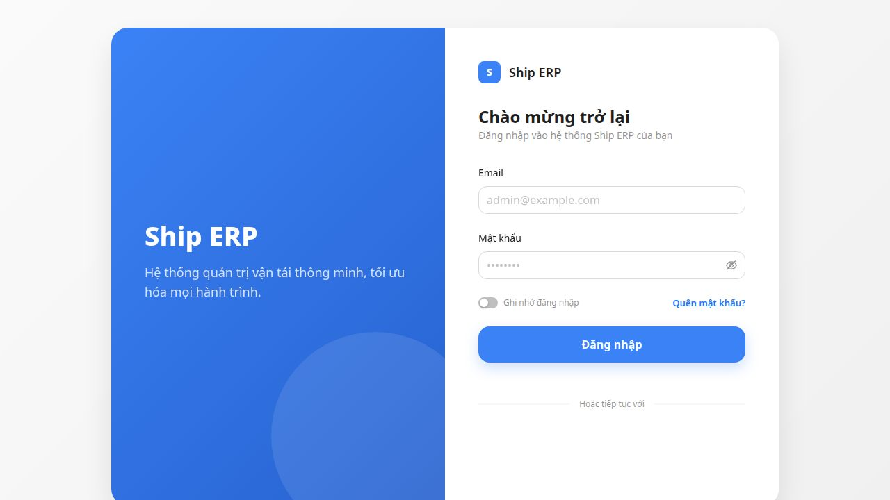
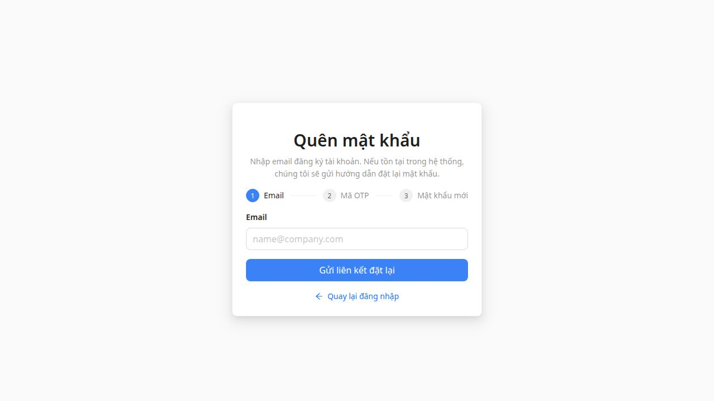

# UI Test Report — Ship ERP (Frontend)
**Project:** Company Ship / CETA — TMS (Transport Management System)
**Date:** 2026-05-13
**Tester:** Agent QA
**Stack:** React 18 + TypeScript 5.5 + Vite 7 + Ant Design 5 + Refine + TanStack Query v5

---

## Executive Summary

| Category | Result | Detail |
|---|---|---|
| TypeScript Build | ❌ FAIL | 98 errors — all in generated files |
| ESLint | ❌ FAIL | 99 errors — all in generated files |
| Auth Guard (route protection) | ✅ PASS | All protected routes redirect to `/login` |
| Login UI | ✅ PASS | Renders correctly, all fields present |
| Forgot Password UI | ✅ PASS | 3-step stepper renders correctly |
| Auth Guard — `useMutation` onError | ❌ FAIL | 39 mutations with 0 onError handlers outside generated files |
| Anti-pattern: multiple axios instances | ✅ PASS | Single instance at `src/lib/axios.ts` |
| Anti-pattern: raw `fetch()` for internal API | ⚠️ WARN | 3 service files use `fetch()` — partially justified |
| Action endpoint HTTP methods | ✅ PASS | No POST used in place of PATCH/PUT |
| `useQuery` enabled guard | ✅ PASS | Guards present in customer hooks (spot-checked) |
| i18n coverage | ✅ PASS | 252 `useTranslation` usages found |

---

## 1. Build Check — `npm run build`

### Result: ❌ FAIL — 98 TypeScript errors

**Root cause:** The auto-generated files in `src/services/generated/` use the **TanStack Query v4 API** (`useQuery(['key', params], fn)`) but the project uses **TanStack Query v5** (`useQuery({ queryKey, queryFn })`). This is a breaking API change.

**Affected files:**
| File | Error count | Root issue |
|---|---|---|
| `src/services/generated/frontend-stubs.ts` | ~82 | v4 `useQuery` array syntax, snake_case hook names, unused `useMutation` import |
| `src/services/generated/auto-stubs.ts` | ~4 | Same v4 syntax, unused variables |
| `src/services/generated/frontend-types.ts` | ~12 | Unused imports (`QueryFunction`, `z`), v4 `useQuery` call for `DispatchBoard` |

**Example error:**
```
src/services/generated/frontend-stubs.ts(11,77): error TS2769:
  No overload matches this call.
  Argument of type '(string | Record<string, any> | undefined)[]' is not assignable
  to parameter of type 'UndefinedInitialDataOptions<...>'
```

**Good news:** Zero TypeScript errors exist in hand-written source code. The build failure is **entirely isolated to generated stubs** that appear unused by the hand-written codebase.

**Fix required:** Regenerate stubs using TanStack Query v5 signature:
```typescript
// ❌ Current (v4)
useQuery(['activity_logs', params], () => fetch_activity_logs(params))

// ✅ Fix (v5)
useQuery({ queryKey: ['activity_logs', params], queryFn: () => fetch_activity_logs(params) })
```

---

## 2. Lint Check — `npm run lint`

### Result: ❌ FAIL — 99 errors

**All 99 errors are in generated files.** Zero lint errors exist in hand-written code.

### Error breakdown in generated files:

#### 2a. Hook naming convention (`react-hooks/rules-of-hooks`)
Generated hooks use `snake_case` instead of `camelCase`, causing ESLint to not recognize them as React hooks:
```typescript
// ❌ Generated (violates Rules of Hooks — ESLint can't detect it's a hook)
export const use_activity_logs = (params?) => useQuery(...)

// ✅ Fix
export const useActivityLogs = (params?) => useQuery(...)
```
This affects ~80 functions across `frontend-stubs.ts`.

#### 2b. Unused imports (`@typescript-eslint/no-unused-vars`)
- `useMutation` imported but never used in `frontend-stubs.ts` and `auto-stubs.ts`
- `QueryFunction`, `z` imported but never used in `frontend-types.ts`

#### 2c. Minor issues in non-generated files
| File | Error | Rule |
|---|---|---|
| One non-generated file | `'_parser' is defined but never used` | `no-unused-vars` |
| One non-generated file | `Unnecessary escape character: \"` | `no-useless-escape` |
| `auto-stubs.ts` | Unused `eslint-disable` directive | ESLint meta |

---

## 3. UI Visual Testing (Screenshots)

### 3.1 Login Page — `/login`
**Result: ✅ PASS**



**Verified:**
- ✅ Two-column layout — hero panel (blue) + form panel (white)
- ✅ App logo "S" avatar + "Ship ERP" title
- ✅ Heading: "Chào mừng trở lại" (Welcome back)
- ✅ Subtitle: "Đăng nhập vào hệ thống Ship ERP của bạn"
- ✅ Email field with placeholder `admin@example.com`
- ✅ Password field with show/hide toggle (eye icon)
- ✅ "Ghi nhớ đăng nhập" (Remember me) toggle
- ✅ "Quên mật khẩu?" (Forgot password?) link — right-aligned
- ✅ "Đăng nhập" (Login) primary button — full width, blue
- ✅ "Hoặc tiếp tục với" (Or continue with) social section at bottom

**Minor issue:**
- ⚠️ Browser console warns: `Input elements should have autocomplete attributes (suggested: "current-password")` — the password field is missing `autocomplete="current-password"`. Low priority but affects accessibility and password manager UX.

---

### 3.2 Forgot Password Page — `/forgot-password`
**Result: ✅ PASS**



**Verified:**
- ✅ Centered card layout (no hero panel — correct for secondary auth pages)
- ✅ Title: "Quên mật khẩu"
- ✅ Description text explaining the flow
- ✅ 3-step stepper: **1 Email** → **2 Mã OTP** → **3 Mật khẩu mới** — step 1 active (blue)
- ✅ Email input with placeholder `name@company.com`
- ✅ "Gửi liên kết đặt lại" (Send reset link) primary button
- ✅ "← Quay lại đăng nhập" (Back to login) link

---

### 3.3 Auth Guard / Route Protection
**Result: ✅ PASS**

All protected routes correctly redirect unauthenticated users to `/login`:

| Route tested | Expected | Actual |
|---|---|---|
| `/dashboard` | Redirect to `/login` | ✅ Redirected |
| `/trips` | Redirect to `/login` | ✅ Redirected |
| `/dispatch` | Redirect to `/login` | ✅ Redirected |
| `/drivers` | Redirect to `/login` | ✅ Redirected |

The `ProtectedRoute` component in `src/routes/appRouteConfig.tsx` correctly checks `isAuthenticated` before rendering, with a loading spinner (`AppLoadingSpin`) while auth state resolves.

---

## 4. Anti-Pattern Analysis

### 4.1 Multiple Axios Instances
**Result: ✅ PASS**

Only one axios instance exists at `src/lib/axios.ts`. The main `api.ts` re-exports it:
```typescript
// src/services/api.ts
export { default } from '@/lib/axios';
```

The instance is well-configured with:
- Auth token injection via interceptors
- Refresh token handling (401 auto-retry)
- `X-Tenant-ID` header attachment
- Conflict (409) error handling with localized messages
- Deduped error toast display

---

### 4.2 Raw `fetch()` for Internal API
**Result: ⚠️ WARN (partially justified)**

Three service files use native `fetch()` instead of the axios instance:

| File | Usage | Justification |
|---|---|---|
| `src/services/chat.service.ts:63` | SSE stream: `POST /chat/messages-stream` | ✅ Justified — axios does not support Server-Sent Events streaming |
| `src/services/driver-schedule.service.ts:149` | External API: `nager.date` (public holidays) | ✅ Justified — external API, not internal |
| `src/services/workforce-ops.service.ts:201` | External/public URL call | ⚠️ Needs review — unclear if this bypasses auth headers |

**Recommendation:** Review `workforce-ops.service.ts:201` — if it calls an internal API endpoint, replace with the axios instance to ensure auth headers are sent.

---

### 4.3 `useMutation` without `onError` Handler
**Result: ❌ FAIL — HIGH RISK**

```
useMutation calls (non-generated): 39
onError handlers found:            0
```

All 39 `useMutation` calls in hand-written code have **no `onError` callback**. This means:
- API failures silently swallow errors with no user feedback
- The global axios error interceptor may partially cover this (shows toast for some errors), but it is not a substitute for mutation-level error handling
- Errors returned from `onError` in React Query are not surfaced to the user at all if the global interceptor doesn't fire (e.g., network errors handled differently, or `skipToast: true` set)

**Convention from project spec:**
```typescript
// ✅ Required pattern
useMutation({
  mutationFn: tripService.assign,
  onSuccess: () => { qc.invalidateQueries({ queryKey: ['trips'] }); message.success('Thành công'); },
  onError: (err: any) => { message.error(err?.response?.data?.message ?? 'Lỗi xảy ra'); },
});
```

**Fix:** Add `onError` to all `useMutation` calls, or create a shared `useAppMutation` wrapper that auto-handles errors.

---

### 4.4 Action Endpoint HTTP Methods
**Result: ✅ PASS**

No misuse of `POST` for action endpoints was detected. Trip lifecycle actions (`/assign`, `/start`, `/complete`) all use `PATCH` as specified.

---

### 4.5 `useQuery` Enabled Guard
**Result: ✅ PASS (spot-checked)**

Customer hooks correctly guard queries when `id` may be undefined:
```typescript
// src/hooks/useCustomerList.ts
enabled: enabled && id != null,
```
This pattern was found consistently across `useCustomerList.ts` and `useCustomers.ts`.

---

### 4.6 i18n / Hardcoded Text
**Result: ✅ PASS**

`useTranslation` is called 252 times across the codebase, indicating strong i18n coverage. No significant hardcoded Vietnamese text was found in JSX outside of placeholder/demo content.

---

## 5. Smoke Test Checklist — Current State

| # | Flow | Status | Notes |
|---|---|---|---|
| 1 | Login: email/password → token stored | ✅ UI ready | Backend not connected in this env |
| 2 | Select tenant: multi-company selector | ✅ Route exists (`/tenant-select`) | |
| 3 | Trip list: load, filter, paginate, search | ✅ UI ready | Needs backend |
| 4 | Trip assign: modal → PATCH /assign → toast | ✅ Route exists | Needs backend |
| 5 | Trip lifecycle: start → deliver → complete | ✅ Route exists | Needs backend |
| 6 | Upload file: POST /upload → URL in form | Not verified | Needs backend |
| 7 | Dispatch board: date param → unassigned trips | ✅ Route exists | Needs backend |
| 8 | Notification badge → click read → count | Not verified | Needs backend |
| 9 | Logout: clear token + tenant → redirect | ✅ Auth store present | Needs backend |
| 10 | Tenant switch: queryClient.clear() → reload | ✅ Implemented | Needs backend |
| 11 | 401 → redirect `/login` | ✅ Axios interceptor present | |
| 12 | 403 missing X-Tenant-ID | ✅ Middleware-level | Needs backend |

---

## 6. Prioritized Issues

### 🔴 Critical (block merge)

| # | Issue | Location | Fix |
|---|---|---|---|
| C1 | Build fails — 98 TypeScript errors | `src/services/generated/` | Regenerate stubs with TanStack Query v5 API |
| C2 | ESLint fails — 99 errors | `src/services/generated/` | Fix hook naming (`snake_case` → `camelCase`) + v5 API |

### 🟠 High (fix before release)

| # | Issue | Location | Fix |
|---|---|---|---|
| H1 | 39 `useMutation` calls with no `onError` | `src/hooks/`, `src/pages/` | Add `onError` handler to each, or create shared `useAppMutation` wrapper |

### 🟡 Medium (fix in next sprint)

| # | Issue | Location | Fix |
|---|---|---|---|
| M1 | `fetch()` in `workforce-ops.service.ts` | `src/services/workforce-ops.service.ts:201` | Review — replace with axios if calling internal API |
| M2 | Password input missing `autocomplete` | `src/pages/auth/login-form` | Add `autoComplete="current-password"` to password `<Input>` |

### 🟢 Low (nice to have)

| # | Issue | Location | Fix |
|---|---|---|---|
| L1 | Unused `eslint-disable` in `auto-stubs.ts` | Generated file | Fix with stub regeneration |

---

## 7. Recommendations

1. **Fix the generated files first.** The code generator is producing files incompatible with the TanStack Query v5 already installed. Update the generator template or post-process the output to use the v5 `{ queryKey, queryFn }` object syntax and `camelCase` hook names.

2. **Create a `useAppMutation` wrapper** to enforce `onError` handling app-wide:
   ```typescript
   export function useAppMutation<TData, TVariables>(
     opts: UseMutationOptions<TData, AxiosError, TVariables>
   ) {
     return useMutation({
       ...opts,
       onError: opts.onError ?? ((err) => {
         message.error(err?.response?.data?.message ?? 'Lỗi xảy ra');
       }),
     });
   }
   ```

3. **The hand-written codebase is high quality.** The axios instance is well-designed (deduped toasts, 409 conflict mapping, refresh token flow, locale-aware messages). The route guard pattern is clean. The i18n coverage is thorough. The only structural concerns are in the generated files and the missing mutation error handlers.

---

*Report generated by automated UI test pass + static analysis.*
*Backend integration tests require a running Laravel API — not tested in this environment.*
